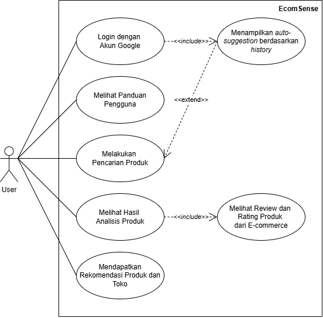
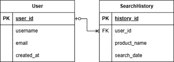

# EcomSense

## Kelompok B1_06
**Anggota Kelompok:**
- Marchel Rianra Glendrikho Simanjuntak (22/494013/TK/54157)
- Lana Fitria Dewani (22/494292/TK/54203)
- Moh. Nazril Ilham (22/493142/TK/54000)

## Project Senior Project TI
**Instansi:**  
Departemen Teknologi Elektro dan Teknologi Informasi, Fakultas Teknik, Universitas Gadjah Mada

**Nama Produk:** EcomSense  
**Jenis Produk:** Aplikasi Chatbot  

## Latar Belakang & Permasalahan
Dalam era digital saat ini, belanja online telah menjadi bagian penting dari kehidupan masyarakat. Berbagai e-commerce menawarkan ribuan produk dengan ulasan pengguna yang dapat membantu calon pembeli dalam mengambil keputusan. Namun, banyaknya pilihan dan ulasan yang diberikan oleh pembeli lain seringkali membuat calon pembeli bingung dalam menentukan pilihan. Selain itu, rasa kurang percaya terhadap produk yang dijual di marketplace menjadi salah satu kendala utama.

Aplikasi EcomSense hadir untuk memudahkan calon pembeli dalam menemukan produk yang sesuai dengan kebutuhan mereka, dengan kualitas terbaik dan harga yang kompetitif, melalui pemanfaatan Artificial Intelligence.

## Ide Solusi
Untuk membantu pengguna dalam mengambil keputusan sebelum membeli suatu produk, aplikasi web ini menawarkan solusi berbasis AI dan analisis sentimen. Fitur-fitur utama yang disediakan antara lain:

- **Chatbot:** Membantu pengguna dalam mencari produk dan menjawab pertanyaan terkait.
- **Rekomendasi:** Memberikan rekomendasi produk berdasarkan preferensi dan kebutuhan pengguna.
- **Analisis Review Produk:** Menganalisis ulasan produk dari berbagai e-commerce untuk memberikan gambaran kualitas produk.

## Analisis Kompetitor

### Kompetitor 1: Tokopedia
- **Jenis Produk:** Marketplace  
- **Target Customer:** UMKM  
- **Kelebihan:** Tokopedia memiliki jangkauan pasar yang luas, sistem pembayaran dan logistik terintegrasi, serta beragam pilihan promosi untuk penjual dan pembeli.  
- **Kekurangan:** Biaya layanan dan komisi cukup tinggi, serta persaingan antar penjual yang sangat ketat.  
- **Key Competitive Advantage & Unique Value:** Fokus pada kemudahan akses pasar bagi UMKM kecil, yang memungkinkan mereka untuk mengembangkan bisnis dengan mudah.  

### Kompetitor 2: Octane AI
- **Jenis Produk:** Chatbot berbasis AI untuk e-commerce  
- **Target Customer:** Pemilik toko online (terutama di Shopify)  
- **Kelebihan:** Integrasi yang kuat dengan Shopify, chatbot yang memberikan rekomendasi produk, serta kemampuan pengumpulan data pelanggan yang dapat membantu pemilik toko dalam meningkatkan penjualan.  
- **Kekurangan:** Layanan terbatas hanya pada pengguna Shopify dan tidak memiliki fitur analisis sentimen ulasan produk.  
- **Key Competitive Advantage & Unique Value:** Personalisasi interaksi pelanggan dan integrasi yang kuat dengan Shopify, yang memungkinkan pemilik toko memberikan pengalaman belanja yang lebih baik.  

### Kompetitor 3: Bukalapak Mitra
- **Jenis Produk:** E-commerce  
- **Target Customer:** UMKM  
- **Kelebihan:** Bukalapak Mitra menawarkan dukungan komunitas bagi pengusaha kecil, fitur grosir dan kemitraan, serta program pelatihan dan edukasi untuk UMKM.  
- **Kekurangan:** Tidak semua fitur tersedia secara gratis dan kurang fleksibel dalam kustomisasi toko.  
- **Key Competitive Advantage & Unique Value:** Menyediakan fitur komunitas untuk membantu pengusaha saling berbagi pengalaman dan meningkatkan bisnis mereka.

## Tujuan Produk
Membantu calon customer dalam memilih produk yang sesuai dengan preferensi yang diinginkan. Dengan menggunakan konsep AI, chatbot nantinya dapat memberikan rekomendasi produk yang sesuai dengan kebutuhan pengguna dan menganalisis sentimen dari ulasan produk.

## Pengguna Potensial
Pengguna potensial utama dari aplikasi ini adalah calon pembeli. Selain itu, brand dan produsen juga dapat menggunakan produk ini untuk mengamati perkembangan serta performa produk mereka berdasarkan analisis sentimen ulasan.

## Use Case Diagram

## Functional Requirements

| **Fitur**                        | **Deskripsi**                                                                                                                       |
|----------------------------------|-------------------------------------------------------------------------------------------------------------------------------------|
| **Panduan Pengguna**             | Sistem menampilkan pop-up berisi panduan penggunaan saat pertama kali user membuka web.                                              |
| **Autentikasi**                  | Pengguna dapat melakukan login untuk mengakses fitur personalisasi, seperti penyimpanan dan pengelolaan riwayat pencarian.           |
| **Pencarian**                    | Pengguna dapat memasukkan nama produk di kolom pencarian, dengan fitur auto-suggestion berdasarkan riwayat pencarian.                |
| **Pengambilan dan Analisis Data**| Sistem mengambil review dari Shopee dan Tokopedia, kemudian melakukan analisis sentimen untuk menghasilkan skor kelayakan produk.    |
| **Hasil Analisis Sentimen**      | Sistem menampilkan skor analisis sentimen dan 3–4 review terpilih yang paling representatif.                                          |
| **Perbandingan Toko**            | Sistem menampilkan perbandingan harga dan rating dari berbagai toko terkait produk yang dicari.                                       |
| **Rekomendasi Produk**           | Sistem memberikan rekomendasi toko terbaik untuk pembelian beserta link, serta alternatif produk serupa yang relevan.                |

## Entity Relationship Diagram

## Low-Fidelity Wireframe

## Gantt Chart

